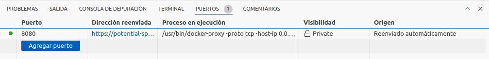
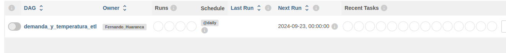
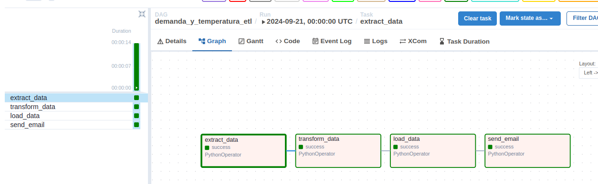

## Projecto Final Documentacion

Compañia Administradora del Mercado Mayorista Argentino Sociedad Anonima (CAMMESA) se encarga
de operar el el mercado electrico. 
En este proyecto nos encargaremos de obtener datos sobre la demanda de energia en distintas
regiones de Argentina y de temperatura, ya que es una variable fundamental a la hora de entender
la demanda.

Vamos a extraer datos de algunas regiones del sistema de interconexion argentino (SADI) que nos
resultan de interes. 

- 425 Provincia de Buenos Aires
- 111 Patagonia 
- 419 Noroeste Argentino
 
Las mismas se encuentran en un archivo .json:

 ```bash
    etl_cammesa/id_regiones.json
 ```

## Modelado de tabla

La tabla que se genera para almacenar los datos se encuentra en:
 ```bash
    etl_cammesa/sql_files/
 ```


## Documentacion Entrega

### Taskfile
 - Taskfile (Automatizacion de procesos)[TASKFILE](https://taskfile.dev/)
 - Generara la carpeta /bin donde tendremos task
 ```bash
    sh -c "$(curl --location https://taskfile.dev/install.sh)" -- -d
 ```

### Inicio proyecto

 - Una vez se halla generado la carpeta bin ejecutaremos en la terminal
 ```bash
    ./bin/task pre_project
 ```

De esta manera habremos generado las carpetas y archivos necesarios para que nuestro
projecto funcione. 

- Dentro de la siguiente ubicacion, se debe completar las variables.
```bash
    etl_cammesa/.env
 ```


- Una vez definidas las variables de entorno, podemos iniciar nuestros contenedores.

```bash
    ./bin/task start_project
 ```

Comenzara a inicializarse los contenedores, esto puede demorar unos minutos...

- Una vez inicializado iremos a Puertos y en direccion reenviada abrir en el navegador,
puede que haya que refrescar la pagina algunas veces hasta que aparezca el login.



Dentro de el localhost iniciaremos sesion con:
- Login: airflow
- pass: airflow

En caso de que tire error volver a repetir el paso de abrir en navegador desde puertos.

Veremos nuestra dag y la activaremos



Es posible que si el proceso se este haciendo desde Codespace Github se tenga que volver a refrescar.



Una vez ejecutada la dag se encargara de:
- Descargar los datos de las regiones que establecimos
- Transformar y limpiar datos erroneos
- Subirlo a una cuenta de amazon redshift
- Enviarnos un mail al finalizar el proceso

### Finalizar proyecto

En caso de querer dar de baja los containers

```bash
    ./bin/task down_project
 ```


### Limpiar cache 
```bash
    ./bin/task clean_up
 ```


