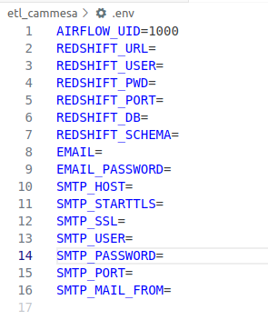

## Projecto Final Documentacion

Compañia Administradora del Mercado Mayorista Argentino Sociedad Anonima (CAMMESA) se encarga
de operar el el mercado electrico. 
En este proyecto nos encargaremos de obtener datos sobre la demanda de energia en distintas
regiones de Argentina y de temperatura, ya que es una variable fundamental a la hora de entender
la demanda.

Vamos a extraer datos de algunas regiones del sistema de interconexion argentino (SADI) que nos
resultan de interes. 

- 425 Provincia de Buenos Aires
- 111 Patagonia 
- 419 Noroeste Argentino
 
Las mismas se encuentran en un archivo .json:

 ```bash
    etl_cammesa/id_regiones.json
 ```


## Documentacion Entrega

### Taskfile
 - Taskfile (Automatizacion de procesos)[TASKFILE](https://taskfile.dev/)
 - Generara la carpeta /bin donde tendremos task
 ```bash
    sh -c "$(curl --location https://taskfile.dev/install.sh)" -- -d
 ```

### Documentacion de la entrega final

 - Una vez se halla generado la carpeta bin ejecutaremos en la terminal
 ```bash
    ./bin/task pre_project
 ```

De esta manera habremos generado las carpetas y archivos necesarios para que nuestro
projecto funcione. 

- Dentro de la siguiente ubicacion, se debe completar las variables.
```bash
    etl_cammesa/.env
 ```



Comenzara a inicializarse los contenedores, esto puede demorar unos minutos...

Una vez inicializado iremos a Puertos


### SCHEMA REALIZADO E INESTADO


